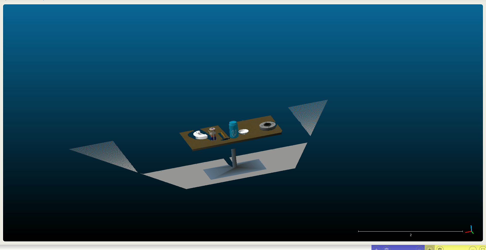
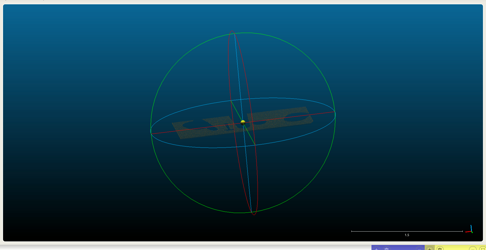
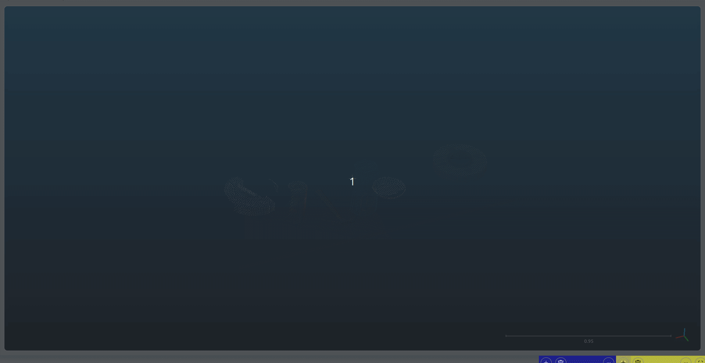

# 3d-perception-lab

A laboratory for 3D perception experiments, focusing on point cloud analysis, deep learning, and robotic vision.

---

## Project: Plane Segmentation with RANSAC

This project demonstrates how to isolate a dominant plane (like a tabletop) from a 3D point cloud. We then separate the points belonging to the plane (**inliers**) from the points that do not (**outliers**, e.g., objects on the table).

This process is a fundamental step in many robotics and perception tasks, such as object detection and grasping.

### What is RANSAC?

RANSAC stands for **RANdom SAmple Consensus**. It's a powerful algorithm used to find a specific model (like a plane, line, or sphere) in data that is contaminated with outliers.

Here’s a simple, step-by-step idea of how it works to find a plane:

1.  **Sample:** It randomly picks the minimum number of points needed to define a plane (which is 3 points).
2.  **Hypothesize:** It creates a mathematical model of a plane that perfectly fits those 3 points.
3.  **Score:** It then checks every other point in the entire cloud and counts how many of them are "close enough" to this plane. The "closeness" is defined by a distance threshold (in our code, `max_distance = 0.01`). The points that are close enough are called the "inlier set."
4.  **Repeat:** The algorithm repeats steps 1-3 many times (e.g., 1000 iterations). Each time, it keeps track of the "inlier set" with the most points.
5.  **Conclude:** After all iterations, the plane that had the largest number of inliers is chosen as the "best" model.

RANSAC is robust because even if it randomly picks one or two outlier points, that plane won't have a large inlier set, and it will be discarded in favor of a plane that truly represents the main surface.

---

### The Data (Before Segmentation)

The process starts with a noisy, unfiltered point cloud. This is the `tabletop.pcd` file, which contains a table, objects on the table, and potentially points from the surrounding room.



---

### The Segmentation Pipeline

To get a clean result, we can't just run RANSAC on the raw cloud. We first apply filters to clean the data and isolate our region of interest.

1.  **Voxel Grid Filter:** The raw cloud has too many points. We use a **Voxel Grid Filter** to downsample it. This creates a 3D grid (with 1cm x 1cm x 1cm "voxels") and merges all points within each cube into a single new point. This drastically speeds up processing without losing the main structure.

2.  **PassThrough Filter:** We isolate our **Region of Interest (ROI)**. We only care about the table, not the floor or ceiling. A **PassThrough Filter** is used to "slice" the cloud, keeping only the points within a specific `z` axis (height) range.
    * `axis_min = 0.6`
    * `axis_max = 1.1`

3.  **RANSAC Segmentation:** Now, on the cleaned and filtered cloud, we run the RANSAC algorithm as described above.
    * `seg.set_model_type(pcl.SACMODEL_PLANE)`: We tell it we are looking for a plane.
    * `seg.set_method_type(pcl.SAC_RANSAC)`: We tell it to use the RANSAC method.
    * `seg.set_distance_threshold(0.01)`: We set our key parameter. Any point within **1cm** of the model will be counted as an inlier.

4.  **Extraction:** The `seg.segment()` command returns a 1D array of **indices** (the `inliers`). We use this list of indices to extract two new point clouds:
    * **Inliers:** By passing the indices and `negative=False`, we extract all the points that *belong* to the plane.
    * **Outliers:** By passing the same indices and `negative=True`, we extract all the points that *do not* belong to the plane.

---

### The Results

#### Inliers (The Table)

This cloud contains *only* the points that RANSAC identified as part of the dominant plane.



#### Outliers (The Objects)

This cloud contains everything that was *not* the plane. Because we filtered out the floor and walls, what remains are the objects sitting on top of the table. This cloud can now be used for further analysis, like clustering or object identification.




---

### How to Run

1.  **Dependencies:** Make sure you have `python-pcl` installed.
    ```bash
    pip install python-pcl
    ```
    (Note: `python-pcl` has non-Python dependencies like the PCL library itself. See its documentation for full installation instructions.)

2.  **Run the script:**
    ```bash
    python Tabletop_Segmentation.py
    ```


3.  **Outputs:** The script will generate several `.pcd` files:
    * `tabletop_voxel_filtered.pcd`: The downsampled cloud.
    * `pass_through_filtered.pcd`: The sliced/filtered cloud that is fed into RANSAC.
    * `extracted_inliers.pcd`: The final table plane.
    * `extracted_outLiers.pcd`: The final objects on the table.